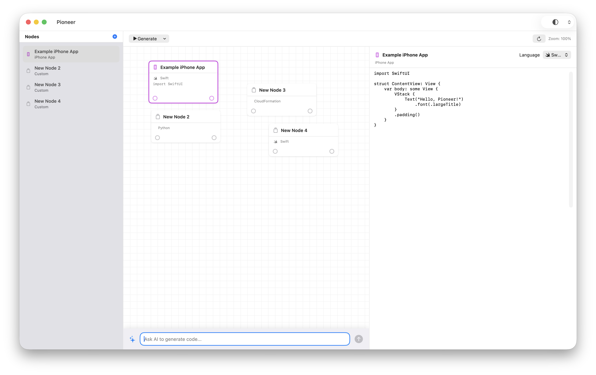
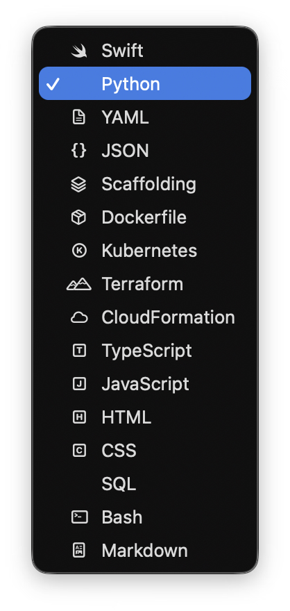

# Pioneer

**A Visual, Node-Based AI Code Editor and Systems Architect Tool**

[](https://www.apple.com/macos/)
[](https://swift.org/)
[](https://developer.apple.com/xcode/swiftui/)

Pioneer is a revolutionary macOS-native application that reimagines software development through visual, node-based architecture. Built entirely with SwiftUI, Pioneer enables developers to visually design, generate, and deploy entire software systems—from mobile apps to cloud infrastructure—all in one unified interface.

## 📸 Screenshots


*Pioneer - Visual Node-Based AI Code Editor*

## 🎯 Vision

Pioneer is designed to become the **ultimate visual development environment** where:

- **Visual Architecture**: Design entire software systems as interconnected nodes, where each node represents a component, service, or module
- **AI-Powered Generation**: Leverage AI to automatically generate production-ready code for any node based on natural language prompts
- **Multi-Platform Support**: Generate and deploy to multiple platforms simultaneously:
  - Native macOS applications
  - iOS/iPadOS applications
  - Web applications and websites
  - Cloud infrastructure (AWS, Azure, GCP)
  - Containerized services (Docker, Kubernetes)
- **Intelligent Scaffolding**: Automatically scaffold entire project structures, configurations, and deployment pipelines
- **Real-Time Collaboration**: Multiple developers can work on the same visual architecture simultaneously
- **Version Control Integration**: Track changes to your visual architecture with Git integration
- **Live Preview**: See your applications running in real-time as you design them

## ✨ Current Features

### Visual Node Editor
- **Drag & Drop Interface**: Intuitively move nodes around the canvas
- **Zoom & Pan**: Navigate large architectures with smooth zoom and pan controls
- **Connection Management**: Visually connect nodes with interactive connection points
- **Grid Background**: Professional grid system for precise alignment

### Node Types



*Visual representation of different node types in Pioneer*

- **macOS Apps**: Native SwiftUI applications
- **iPhone/iPad Apps**: iOS applications
- **Websites**: Full-stack web applications
- **AWS Backend**: Cloud infrastructure and services
- **Custom Nodes**: Extensible node system for any project type

### Code Generation



*Comprehensive language support in Pioneer*

- **15+ Languages**: Support for high-level languages and frameworks:
  - Swift, Python, TypeScript, JavaScript
  - YAML, JSON, Markdown
  - Dockerfile, Kubernetes, Terraform, CloudFormation
  - HTML, CSS, SQL, Bash
  - Scaffolding templates
- **AI Integration**: Natural language prompts generate production-ready code
- **Language-Aware**: AI understands context and generates appropriate code for each language

### Python Environment Management
- **Isolated Environments**: Each Python node runs in its own virtual environment
- **Dependency Management**: Automatic requirements.txt handling
- **Environment Isolation**: No conflicts between different Python projects

### Developer Experience
- **Code Editor**: Built-in code editor with syntax highlighting
- **Theme Support**: Light, Dark, and System appearance modes
- **Keyboard Shortcuts**: Efficient navigation and actions
- **Context Menus**: Quick actions via right-click

## 🚀 Planned Features

### Phase 1: Core AI Integration
- [ ] **LLM Integration**: Connect to OpenAI, Anthropic, or local models
- [ ] **Context-Aware Generation**: AI understands node connections and dependencies
- [ ] **Multi-Model Support**: Switch between different AI models
- [ ] **Prompt Templates**: Pre-built prompts for common scenarios

### Phase 2: Advanced Code Generation
- [ ] **Full-Stack Generation**: Generate complete applications with frontend, backend, and database
- [ ] **API Integration**: Auto-generate REST APIs, GraphQL schemas, and WebSocket handlers
- [ ] **Database Schemas**: Visual database design with automatic migration generation
- [ ] **Authentication Systems**: Generate OAuth, JWT, and session-based auth

### Phase 3: Deployment & Infrastructure
- [ ] **One-Click Deployment**: Deploy to AWS, Azure, GCP with a single click
- [ ] **CI/CD Pipelines**: Auto-generate GitHub Actions, GitLab CI, or Jenkins pipelines
- [ ] **Infrastructure as Code**: Generate Terraform, CloudFormation, or Pulumi configurations
- [ ] **Container Orchestration**: Kubernetes, Docker Compose, and ECS configurations

### Phase 4: Collaboration & Version Control
- [ ] **Real-Time Collaboration**: Multiple users editing the same canvas
- [ ] **Git Integration**: Visual diff, merge, and conflict resolution
- [ ] **Version History**: Track changes to your visual architecture
- [ ] **Branching**: Create branches for different features or environments

### Phase 5: Testing & Quality
- [ ] **Test Generation**: Auto-generate unit, integration, and E2E tests
- [ ] **Code Quality**: Linting, formatting, and static analysis
- [ ] **Performance Monitoring**: Built-in performance profiling
- [ ] **Error Handling**: Automatic error handling and logging generation

### Phase 6: Advanced Features
- [ ] **Plugin System**: Extend Pioneer with custom node types and generators
- [ ] **Template Library**: Community-shared node templates and architectures
- [ ] **Marketplace**: Discover and install pre-built components
- [ ] **Export Formats**: Export to various formats (diagrams, documentation, code)

## 🏗️ Architecture

Pioneer is built with a clean, modular architecture:

```
Pioneer/
├── Sources/
│   ├── PioneerApp.swift          # Main app entry point
│   ├── Models/
│   │   ├── Node.swift             # Node data model
│   │   └── ProjectManager.swift   # Project state management
│   ├── Views/
│   │   ├── ContentView.swift      # Main content view
│   │   ├── SidebarView.swift      # Node list sidebar
│   │   ├── ToolbarView.swift      # Toolbar with actions
│   │   ├── NodeCanvasView.swift   # Visual node editor canvas
│   │   ├── CodeEditorView.swift   # Code editing panel
│   │   └── AIPromptInput.swift    # AI prompt interface
│   └── Services/
│       ├── PythonBridge.swift     # Python integration layer
│       └── AIService.swift        # AI code generation service
├── Package.swift                  # Swift Package Manager manifest
└── README.md                      # This file
```

## 🛠️ Building and Running

### Prerequisites

- macOS 13.0 (Ventura) or later
- Swift 5.9 or later
- Python 3 (for Python node support)

### Build

```bash
swift build
```

### Run

```bash
swift run Pioneer
```

Or use the run script:

```bash
./run.sh
```

### Build App Bundle with Icon

To create a proper macOS app bundle:

```bash
./build-app.sh
open Pioneer.app
```

## 📖 Usage

### Creating Nodes

1. Click the "+" button in the sidebar
2. Or press `Cmd+N`
3. Select a node type from the list

### Editing Code

1. Select a node from the sidebar or canvas
2. Edit code in the code editor panel (right side)
3. Change language using the language picker

### Connecting Nodes

1. Click the **output circle** (right side) of a source node
2. Click the **input circle** (left side) of a target node
3. Connections represent dependencies and data flow

### AI Code Generation

1. Select a node
2. Type your prompt in the AI input at the bottom
3. Press Enter or click submit
4. Generated code automatically populates the node's editor

### Canvas Navigation

- **Pan**: Hold `Cmd` and drag
- **Zoom**: Pinch or scroll
- **Reset View**: Click reset button in toolbar

## 🎨 Design Philosophy

Pioneer is built on the principle that **visual thinking** is the most powerful way to design software systems. By representing code as interconnected nodes, developers can:

- **See the Big Picture**: Understand entire system architectures at a glance
- **Think in Abstractions**: Focus on high-level design without getting lost in implementation details
- **Iterate Quickly**: Make changes visually and see results immediately
- **Collaborate Effectively**: Share visual architectures that anyone can understand

## 🤝 Contributing

Pioneer is in active development. Contributions are welcome! Areas where help is needed:

- AI model integrations
- Additional node types
- Deployment integrations
- UI/UX improvements
- Documentation
- Testing

## 📝 License

This project is provided as-is for development purposes.

## 🔮 Future Vision

Pioneer aims to become the **default tool** for:

- **Rapid Prototyping**: Build MVPs in minutes, not days
- **System Design**: Visualize and document complex architectures
- **Code Generation**: Let AI handle boilerplate while you focus on logic
- **Multi-Platform Development**: Build once, deploy everywhere
- **Team Collaboration**: Share visual designs that everyone understands
- **Learning**: Teach software architecture through visual examples

## 🌟 Why Pioneer?

Traditional IDEs force you to think in files and folders. Pioneer lets you think in **components and connections**—the way your brain naturally works. It's not just a code editor; it's a **visual programming language** for the modern era.

---

**Built with ❤️ using SwiftUI on macOS**
