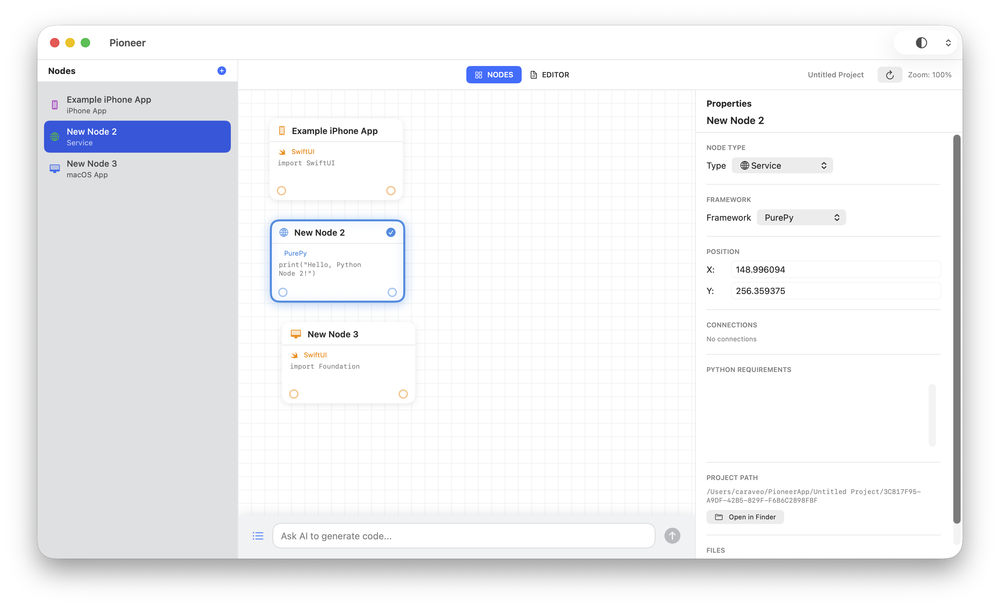
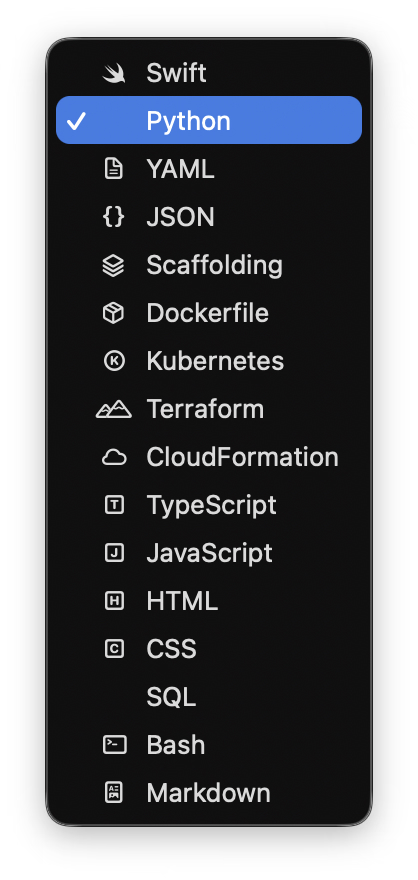
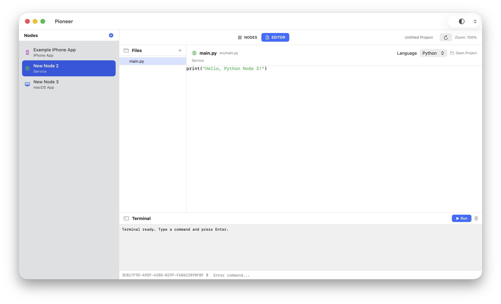

# Pioneer


**Design systems. Generate code. Ship pods.**  
A macOS-native, visual AI platform for building entire software stacks—from mobile apps to databases to Kubernetes.

[](https://www.apple.com/macos/)
[](https://swift.org/)
[](https://developer.apple.com/xcode/swiftui/)
[](https://github.com/Caraveo/pioneer/releases)
[](https://github.com/Caraveo/pioneer)

## Vision

**Software is no longer one app. It’s a constellation.**  
Mobile clients, APIs, data stores, cloud glue, and the teams that own them. Traditional tools force you to juggle IDEs, terminals, YAML, and repos as if they were separate universes. Pioneer collapses that chaos into one canvas—where every piece of your product is a **Pod**: visible, connected, and ready to run.

### Why Pioneer exists

Modern product teams don’t ship “a codebase.” They ship **systems**—iOS next to Android, Python services next to Postgres, web frontends next to infra. Scale demands clarity: Android, Apple, and Web teams need boundaries they can own without drowning in monorepo politics. Pioneer was built on a simple bet: **if architecture is visual, generation is intelligent, and every unit of work has its own code, container, and git history, software becomes navigable again.**

### What Pioneer is

Pioneer is a **visual systems architect and AI code studio for macOS**. You design your product as interconnected pods—Services, Databases, iOS, Android, macOS, AWS, and more—each with a deliberate framework (Python by default for services, PostgreSQL for databases, SwiftUI for Apple, Kotlin for Android, and the rest of a modern stack). One prompt can write **application code and Kubernetes YAML together**, grounded in the selected pod’s language and context. One click runs that pod. One **GIT** view owns that pod’s repository. One canvas tells the story of the whole system.

### How Pioneer works

1. **Compose** — Drop pods on the canvas. Connect them. Choose type and framework; Pioneer assumes the right stack so you stay in the flow.  
2. **Generate** — Ask AI in plain language. It generates for *that* pod only—proper syntax, full pod context, dual artifacts: **CODE** and **YAML**.  
3. **Craft** — Switch views: **PODS** for architecture, **CODE** for source, **YAML** for the K8s pod, **GIT** for branches, commits, and push to origin.  
4. **Run** — Each Pioneer pod maps to its **own Kubernetes Pod**. Code is injected into the container and executed where it belongs.  
5. **Scale** — Each pod is its **own git repository**, so teams grow independently: Apple ships Apple, Android ships Android, Web ships Web—without waiting on a single monorepo.

### The promise

Pioneer is not “another editor with a chatbot.” It’s a **prompt-based infrastructure and product canvas**: architecture you can see, code you can trust, containers you can run, and repos you can own. From first service to full fleet—**you pioneer the system; Pioneer handles the scaffolding.**

---

## 🚀 What Pioneer Does

**Pioneer is a visual development platform that manages your entire software stack with AI models and visual pods.**

Pioneer empowers developers to build, manage, and deploy complete software systems—from iOS apps to AWS infrastructure—all through an intuitive visual interface. Whether you're building native applications, frontend interfaces, backend services, databases, or cloud infrastructure, Pioneer provides a unified environment where every component is represented as an interconnected **pod**.

### Key Capabilities:

- **🎯 Framework Management**: Seamlessly manage multiple frameworks and technologies in isolated environments
  - iOS/macOS apps (Swift, SwiftUI)
  - Web applications (React, Vue, Angular, Next.js)
  - Backend services (Node.js, Express, NestJS, Django, Flask, FastAPI)
  - Native applications (Rust, Go, Java, Spring Boot)
  - Infrastructure as Code (Docker, Kubernetes, Terraform)

- **🤖 AI-Powered Code Generation**: Leverage advanced AI models to generate production-ready code from natural language prompts
  - Context-aware code generation
  - Multi-model support (OpenAI, Anthropic, Google Gemini, Ollama, MistyStudio)
  - Framework-specific templates and scaffolding

- **📝 Native Code Editor**: Built-in, syntax-highlighted code editor with real-time file management
  - Multi-file support per node
  - Language-aware syntax highlighting
  - Auto-save functionality
  - File browser and management

- **🔗 Visual Architecture**: Design entire systems as interconnected nodes
  - Visual representation of system architecture
  - Node connections represent dependencies and data flow
  - Drag-and-drop interface for intuitive design

- **⚡ Isolated Environments**: Each node runs in its own isolated environment
  - Python virtual environments
  - Node.js version management (Volta)
  - No conflicts between projects

- **💾 Project Management**: Save and load complete projects as `.code` archives
  - Preserves all code, node data, and canvas state
  - Portable project files
  - Version control ready

> ⚠️ **PREALPHA WARNING**: Pioneer is currently in **PREALPHA** stage and is **NOT ready for production use**. This software requires extensive setup and configuration. Many features are experimental, incomplete, or may not work as expected. Use at your own risk.

> 📋 **Setup Requirements**: Pioneer requires significant manual configuration including:
> - API keys for AI providers (OpenAI, Anthropic, Google Gemini)
> - Local model setup (Ollama, MistyStudio) if using local models
> - Python 3 installation for Python node support
> - Manual configuration of AI settings
> - Understanding of Swift/SwiftUI development for troubleshooting

Pioneer is a revolutionary macOS-native application that reimagines software development through visual, node-based architecture. Built entirely with SwiftUI, Pioneer enables developers to visually design, generate, and deploy entire software systems—from mobile apps to cloud infrastructure—all in one unified interface.

## ✨ Current Features

### Visual Node Editor
- **Drag & Drop Interface**: Intuitively move nodes around the canvas
- **Zoom & Pan**: Navigate large architectures with smooth zoom and pan controls
- **Connection Management**: Visually connect nodes with interactive connection points
- **Grid Background**: Professional grid system for precise alignment

### Node Types



*Visual representation of different node types in Pioneer*

- **macOS Apps**: Native SwiftUI applications
- **iPhone/iPad Apps**: iOS applications
- **Websites**: Full-stack web applications
- **AWS Backend**: Cloud infrastructure and services
- **Custom Nodes**: Extensible node system for any project type

### Code Generation



*Comprehensive language support in Pioneer*

- **15+ Languages**: Support for high-level languages and frameworks:
  - Swift, Python, TypeScript, JavaScript
  - YAML, JSON, Markdown
  - Dockerfile, Kubernetes, Terraform, CloudFormation
  - HTML, CSS, SQL, Bash
  - Scaffolding templates
- **AI Integration**: Natural language prompts generate production-ready code
- **Language-Aware**: AI understands context and generates appropriate code for each language

### Python Environment Management
- **Isolated Environments**: Each Python node runs in its own virtual environment
- **Dependency Management**: Automatic requirements.txt handling
- **Environment Isolation**: No conflicts between different Python projects

### Developer Experience



*Built-in code editor with syntax highlighting and multi-file support*

- **Code Editor**: Built-in code editor with syntax highlighting
- **Theme Support**: Light, Dark, and System appearance modes
- **Keyboard Shortcuts**: Efficient navigation and actions
- **Context Menus**: Quick actions via right-click

## 🚀 Planned Features

### Phase 1: Core AI Integration
- [ ] **LLM Integration**: Connect to OpenAI, Anthropic, or local models
- [ ] **Context-Aware Generation**: AI understands node connections and dependencies
- [ ] **Multi-Model Support**: Switch between different AI models
- [ ] **Prompt Templates**: Pre-built prompts for common scenarios

### Phase 2: Advanced Code Generation
- [ ] **Full-Stack Generation**: Generate complete applications with frontend, backend, and database
- [ ] **API Integration**: Auto-generate REST APIs, GraphQL schemas, and WebSocket handlers
- [ ] **Database Schemas**: Visual database design with automatic migration generation
- [ ] **Authentication Systems**: Generate OAuth, JWT, and session-based auth

### Phase 3: Deployment & Infrastructure
- [ ] **One-Click Deployment**: Deploy to AWS, Azure, GCP with a single click
- [ ] **CI/CD Pipelines**: Auto-generate GitHub Actions, GitLab CI, or Jenkins pipelines
- [ ] **Infrastructure as Code**: Generate Terraform, CloudFormation, or Pulumi configurations
- [ ] **Container Orchestration**: Kubernetes, Docker Compose, and ECS configurations

### Phase 4: Collaboration & Version Control
- [ ] **Real-Time Collaboration**: Multiple users editing the same canvas
- [ ] **Git Integration**: Visual diff, merge, and conflict resolution
- [ ] **Version History**: Track changes to your visual architecture
- [ ] **Branching**: Create branches for different features or environments

### Phase 5: Testing & Quality
- [ ] **Test Generation**: Auto-generate unit, integration, and E2E tests
- [ ] **Code Quality**: Linting, formatting, and static analysis
- [ ] **Performance Monitoring**: Built-in performance profiling
- [ ] **Error Handling**: Automatic error handling and logging generation

### Phase 6: Advanced Features
- [ ] **Plugin System**: Extend Pioneer with custom node types and generators
- [ ] **Template Library**: Community-shared node templates and architectures
- [ ] **Marketplace**: Discover and install pre-built components
- [ ] **Export Formats**: Export to various formats (diagrams, documentation, code)

## 🏗️ Architecture

Pioneer is built with a clean, modular architecture:

```
Pioneer/
├── Sources/
│   ├── PioneerApp.swift          # Main app entry point
│   ├── Models/
│   │   ├── Node.swift             # Node data model
│   │   └── ProjectManager.swift   # Project state management
│   ├── Views/
│   │   ├── ContentView.swift      # Main content view
│   │   ├── SidebarView.swift      # Node list sidebar
│   │   ├── ToolbarView.swift      # Toolbar with actions
│   │   ├── NodeCanvasView.swift   # Visual node editor canvas
│   │   ├── CodeEditorView.swift   # Code editing panel
│   │   └── AIPromptInput.swift    # AI prompt interface
│   └── Services/
│       ├── PythonBridge.swift     # Python integration layer
│       └── AIService.swift        # AI code generation service
├── Package.swift                  # Swift Package Manager manifest
└── README.md                      # This file
```

## 🛠️ Building and Running

### Prerequisites

- macOS 13.0 (Ventura) or later
- Swift 5.9 or later
- Python 3 (for Python node support)

### Build

```bash
swift build
```

### Run

```bash
swift run Pioneer
```

Or use the run script:

```bash
./run.sh
```

### Build App Bundle with Icon

To create a proper macOS app bundle:

```bash
./build-app.sh
open Pioneer.app
```

## 📖 Usage

### Creating Nodes

1. Click the "+" button in the sidebar
2. Or press `Cmd+N`
3. Select a node type from the list

### Editing Code

1. Select a node from the sidebar or canvas
2. Edit code in the code editor panel (right side)
3. Change language using the language picker

### Connecting Nodes

1. Click the **output circle** (right side) of a source node
2. Click the **input circle** (left side) of a target node
3. Connections represent dependencies and data flow

### AI Code Generation

1. Select a node
2. Type your prompt in the AI input at the bottom
3. Press Enter or click submit
4. Generated code automatically populates the node's editor

### Canvas Navigation

- **Pan**: Hold `Cmd` and drag
- **Zoom**: Pinch or scroll
- **Reset View**: Click reset button in toolbar

## 🎨 Design Philosophy

Pioneer is built on the principle that **visual thinking** is the most powerful way to design software systems. By representing code as interconnected nodes, developers can:

- **See the Big Picture**: Understand entire system architectures at a glance
- **Think in Abstractions**: Focus on high-level design without getting lost in implementation details
- **Iterate Quickly**: Make changes visually and see results immediately
- **Collaborate Effectively**: Share visual architectures that anyone can understand

## 🤝 Contributing

Pioneer is in active development. Contributions are welcome! Areas where help is needed:

- AI model integrations
- Additional node types
- Deployment integrations
- UI/UX improvements
- Documentation
- Testing

## 📝 License

This project is provided as-is for development purposes.

## 🔮 Future Vision

Pioneer aims to become the **default tool** for:

- **Rapid Prototyping**: Build MVPs in minutes, not days
- **System Design**: Visualize and document complex architectures
- **Code Generation**: Let AI handle boilerplate while you focus on logic
- **Multi-Platform Development**: Build once, deploy everywhere
- **Team Collaboration**: Share visual designs that everyone understands
- **Learning**: Teach software architecture through visual examples

## 🌟 Why Pioneer?

Traditional IDEs force you to think in files and folders. Pioneer lets you think in **components and connections**—the way your brain naturally works. It's not just a code editor; it's a **visual programming language** for the modern era.

---

**Built with ❤️ using SwiftUI on macOS**
